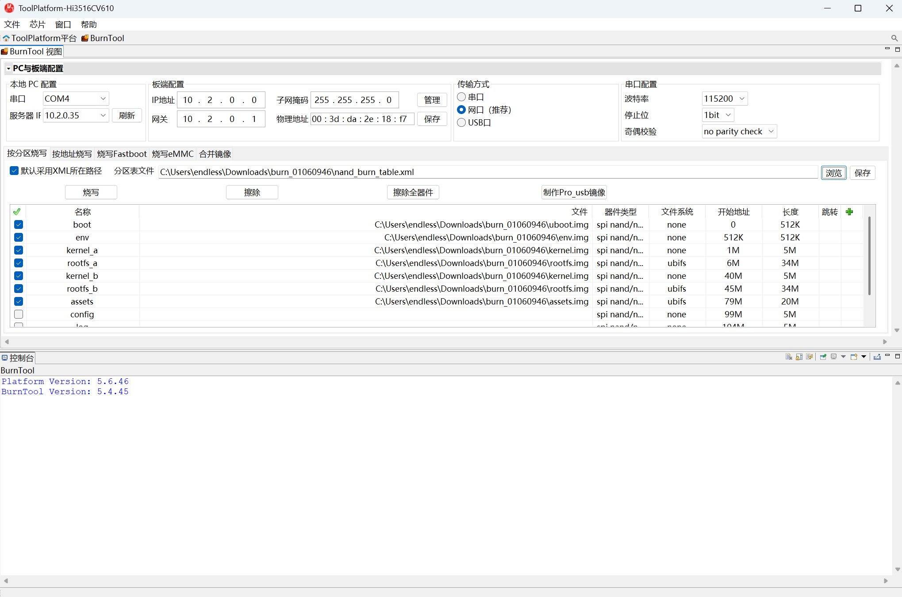

# 安装部署

本章介绍如何为设备烧录固件。

---

## 1. 烧录固件

### 1.1 硬件连接

烧写前，请按照以下方式连接好对应接口：

- **串口**：使用 TTL 协议串口板连接，注意 TX/RX 交叉接线

| 板端 | 串口板 |
|------|--------|
| GND  | GND    |
| RXD  | TXD    |
| TXD  | RXD    |

- **网口**：将设备与 PC 接入同一网段
- **电源**：暂勿上电，等待烧录工具就绪后再上电

### 1.2 烧写流程

1. 打开烧录工具 **ToolPlatform**。

2. 配置烧录参数：
   - **产品**：选择 `Hi3516CV610`
   - **传输方式**：选择 `网口`
   - 点击 **刷新**，通常会自动匹配串口和 IP 信息
   - 确保板端 IP 与 PC 服务器 IP 在同一网段

3. 选择 **分区烧写**，点击 **浏览**，选择固件文件夹下的分区表文件：

   ```
   nand_burn_table.xml
   ```

   

4. 点击 **烧写**，然后将板卡上电（若已上电，请先断电再重新上电）。

5. 等待烧录工具状态更新，烧录成功后会弹窗提示。

---

如有问题请[提交 Issue](https://atomgit.com/endless/endless/issues)。
